# zond

[](https://deepwiki.com/kirrosh/zond)
[](https://www.npmjs.com/package/@kirrosh/zond)

API hygiene scanner for small teams and their coding agents — test REST API endpoints against the OpenAPI spec, catch contract drift, track coverage.

**Use it when you need to:** test REST API endpoints from an OpenAPI spec,
verify an API contract after a deploy, debug a failing HTTP request with
stored run history, or raise endpoint coverage. Works standalone or through
a coding agent (Claude Code, Cursor) — say "test my API" and the agent
drives zond for you.

```bash
curl -fsSL https://raw.githubusercontent.com/kirrosh/zond/master/install.sh | sh   # or: npm i -g @kirrosh/zond
zond init && zond add api my-api --spec ./openapi.json
zond audit --api my-api --safe    # read-only pass: spec lint → probes → tests → coverage → HTML report
```

> **Safe by default.** The first run (`zond audit --safe`) sends read-only
> GET traffic — no writes, no deletes, nothing destructive. Mutating
> probes require an explicit `--live` opt-in, meant for throwaway/sandbox
> accounts only. Running zond against your API won't break it.



Zond reads your OpenAPI spec and gives your AI agent everything it needs to test your API: a focused CLI, safety guardrails, coverage tracking, and run history. You don't need to learn anything new — just describe what you want and the agent runs `zond` commands.

## Install

| Channel | Command |
|---|---|
| **curl** (macOS/Linux) | `curl -fsSL https://raw.githubusercontent.com/kirrosh/zond/master/install.sh \| sh` |
| **npm** (needs Node 20+) | `npm install -g @kirrosh/zond` |
| **Windows** | `iwr https://raw.githubusercontent.com/kirrosh/zond/master/install.ps1 \| iex` |
| **Manual** | grab a binary from [releases](https://github.com/kirrosh/zond/releases/latest) (darwin arm64/x64, linux x64/arm64, win x64) |
| **Claude Code plugin** | `/plugin marketplace add kirrosh/zond` then `/plugin install zond@zond` — the agent skills without `zond init` |
| **Agent skills** ([skills.sh](https://www.skills.sh)) | `npx skills add kirrosh/zond` |

The plugin/skills channels ship the [five zond skills](skills/) (audit
pipeline, depth checks, fixture seeding, triage, target warm-up); the zond
binary itself still comes from any of the channels above.

Every channel ships the same self-contained binary — no Bun or Node
required at runtime (npm uses Node only as a thin launcher).

## Quick Start

Bootstrap a workspace, register your first API, then fill its fixtures:

```bash
zond init                                              # bootstrap workspace (no fixture changes)
zond add api my-api --spec ./openapi.json              # register: copies spec.json + emits manifest
zond doctor --api my-api --missing-only                # gap report: which vars are UNSET
zond prepare-fixtures --api my-api                     # gap report: verify fixtures + which FK vars need a value
```

`prepare-fixtures` **reports** gaps — it never harvests a value (which
record/field fills a path slot is your call). Fill each gap with the
manual helpers (ARV-195):

```bash
zond fixtures add --api my-api customer_id=cus_123 --validate --apply
pbpaste | zond fixtures import --api my-api --from-curl --apply        # paste a curl from devtools
```

`zond init` writes a self-contained [`AGENTS.md`](AGENTS.md) and Claude Code
skills — agents read it and use the CLI directly (`zond run`,
`zond probe static`, `zond db diagnose`, …). No daemon, no transport, no
extra configuration. `init` is workspace-only — it never touches
`.env.yaml`; the fixture loop above is the canonical path.

Each registered API gets four files in `apis/<name>/`:

- `spec.json` — dereferenced OpenAPI snapshot (canonical machine source).
- `.api-catalog.yaml` — endpoint index for agents (cheap to read).
- `.api-resources.yaml` — CRUD chains, FK dependencies, ETag/soft-delete flags.
- `.api-fixtures.yaml` — **manifest** of required `{{vars}}` (read-only, auto-generated).

Plus a sibling `.env.yaml` that **you** fill with the **values** for those
vars (`zond prepare-fixtures` only reports which are missing). The
manifest/values split is strict — see the
[workspace contract](AGENTS.md#workspace-contract) for details.

Run `zond refresh-api <name> [--spec <new-source>]` to re-snapshot when the
upstream spec changes.

Then say to your agent: _"Safely cover the API from openapi.json with tests."_

Want the whole pipeline at once? `zond audit --api my-api --safe` runs
prepare-fixtures → generate → probes → run → coverage → HTML report in a
single read-only shot (safe is the default even without the flag). Add
`--live` for the mutating stages once you're pointed at a sandbox.

See [ZOND.md](ZOND.md) for the full CLI reference.

## What Happens

1. **Point** — you give the agent an OpenAPI spec
2. **Generate** — zond reads the spec, produces YAML test suites (smoke + CRUD)
3. **Run** — tests execute, failures are diagnosed, coverage is tracked

The agent does all three steps autonomously. It asks you only when it needs an auth token or permission to run write operations.

## Why Not Just Ask Claude to Write pytest?

Claude Code can write pytest from scratch — but it takes 30-60 minutes per flow, has no safety guardrails, no coverage tracking, and no run history. Zond gives the agent structured tools to do it in 5 minutes with full visibility.

## Case Studies

Real public-API audits, calibrated findings only — including what was *not* found:

- [GitHub REST API](docs/case-studies/github-rest-api.md) — ~50% of read endpoints return status codes the official spec never declares; 2 live schema violations. Read-only, ~3.5 min.
- [Vercel API](docs/case-studies/vercel-api.md) — a live intermittent 500, ~150 undeclared status codes, ~45 create endpoints stricter than their spec — with zero requests sent to account-delete/billing endpoints. Live, no sandbox.
- [Stripe money lifecycle](docs/case-studies/stripe-lifecycle.md) — drove the full invoice/quote state machine live (`draft→finalize→pay/void`, 15/15 green); the trap that nearly hid the whole lifecycle was a `usd`-default body on a EUR account, not a Stripe bug. Live, test-mode.

## Key Capabilities

| | |
|---|---|
| **Safe by Default** | `--safe` runs only GET requests. `--dry-run` previews without sending. The agent never touches production data without your explicit approval. |
| **Spec-Grounded** | Tests are derived from your OpenAPI schema, not invented from scratch. The spec is the source of truth. |
| **Full Visibility** | Every run is stored in SQLite. Compare runs, track regressions, see exactly what the server returned. |
| **Coverage Tracking** | See which endpoints are tested, which aren't, and what broke since last run. |
| **Schema Validation** | `--validate-schema` checks every JSON response against the OpenAPI schema (types, required, enum, format, `$ref`) — catches contract drift the YAML expectations miss. |
| **Spec Linting** | `zond check spec` static-analyses the OpenAPI document for internal-consistency bugs (e.g. example violates `format: date-time`) and strictness gaps (path-params without `format`, integer params without min/max) — surfaces issues before any HTTP request. |
| **Depth Checks (m-15)** | `zond checks run` runs a schemathesis-style catalog of conformance + security probes (`status_code_conformance`, `negative_data_rejection`, `ignored_auth`, `use_after_free`, …) — boundary-value coverage, broken-auth detection, soft-deleted resource leaks. Every finding ships with a `recommended_action` enum so the agent triages without parsing messages. |
| **SARIF for Code Scanning** | `--report sarif` emits SARIF v2.1.0 with stable `partialFingerprints` — drop-in for `github/codeql-action/upload-sarif@v3` so depth-checks findings show up in GitHub's Security tab. |
| **Concurrent Workers** | `--workers auto` parallelizes runs at the operation level (bounded async-pool, no threading) — runs that took minutes finish in seconds. Pair with `--rate-limit` to stay within an API's RPS budget. |
| **CI-Ready** | One command generates GitHub Actions or GitLab CI workflow. Tests in YAML, in git, with code review. |

## Try It

```
"Cover openapi.json with tests"
"Run only smoke tests against staging"
"What broke since last run?"
"Set up CI for API tests"
```

## Upgrading

`zond update` was removed in favour of system package managers:

```bash
# macOS / Linux — re-run the installer
curl -fsSL https://raw.githubusercontent.com/kirrosh/zond/master/install.sh | sh

# npm
npm install -g @kirrosh/zond@latest
```

## Shell completions

```bash
zond completions bash > ~/.local/share/bash-completion/completions/zond
zond completions zsh  > ~/.zsh/completions/_zond   # then `compinit`
zond completions fish > ~/.config/fish/completions/zond.fish
```

## Documentation

- [ZOND.md](ZOND.md) — full CLI reference
- [docs/quickstart.md](docs/quickstart.md) — step-by-step quickstart (RU)
- [docs/ci.md](docs/ci.md) — CI/CD integration
- [docs/case-studies/](docs/case-studies/) — public-API audit case studies
- [backlog/](backlog/) — project tasks (powered by [Backlog.md](https://backlog.md))

## License

[MIT](LICENSE)
